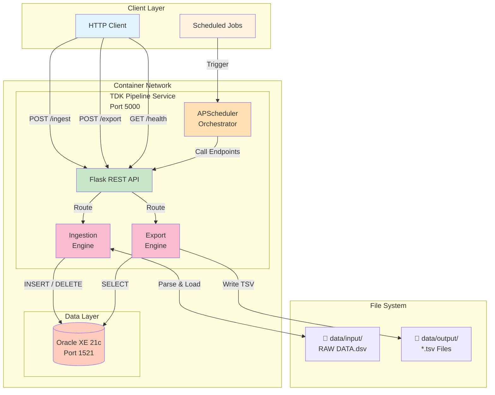

# TDK Data Pipeline Microservices

professional_data_pipeline

A robust, containerized ETL data pipeline designed to ingest raw DSV data into an Oracle Database and export processed data as TSV files. Built with a microservices architecture using Python (Flask), Oracle XE, and Docker Compose for orchestration.

## Features

*   **Microservices Architecture**: Decoupled services for Ingestion, Export, and Scheduling.
*   **Automated Scheduling**: Nightly cron jobs orchestrated by APScheduler (runs at 00:00).
*   **Oracle Database Integration**: Includes a pre-configured Oracle XE 21c container.
*   **High Performance**: Uses bulk operations for efficient data loading.
*   **RESTful APIs**: Manual trigger endpoints for ad-hoc execution.
*   **Containerized**: Fully Dockerized for consistent deployment across environments.

## Architecture

The system consists of three Python microservices and one database container, all orchestrated via Docker Compose.



### Components

| Service | Port | Description |
| :--- | :--- | :--- |
| **Oracle Database** | `1521` | Oracle Database Express Edition (XE) 21c. Stores the `C_DUNS_V` table. |
| **Ingestion Service** | `5001` | Parses pipe-delimited DSV files and bulk inserts them into Oracle. |
| **Export Service** | `5002` | Queries the Oracle database and exports data to tab-separated values (TSV). |
| **Scheduler** | - | Orchestrator that triggers the ingestion and export processes nightly. |

## Prerequisites

*   **Docker** and **Docker Compose** installed on your machine.
*   **Git** (for cloning the repository).

## Installation & Setup

1.  **Clone the Repository**
    ```bash
    git clone https://github.com/<your-username>/tdk-data-pipeline.git
    cd tdk-data-pipeline
    ```

2.  **Configure Environment**
    Copy the example environment file and configure it (defaults are set for the included Oracle XE container).
    ```bash
    cp .env.example .env
    ```

3.  **Prepare Input Data**
    Place your raw data file (`RAW DATA.dsv`) in the `data/input/` directory.
    ```bash
    # Example
    cp /path/to/your/RAW DATA.dsv data/input/
    ```

4.  **Build and Run**
    Launch the entire stack using Docker Compose.
    ```bash
    docker-compose up --build
    ```
    *Note: The first run may take a few minutes as the Oracle Database initializes.*

## Usage

### Automated Execution
By default, the **Scheduler** service is configured to:
1.  Run the full pipeline immediately on startup (`RUN_ON_STARTUP=true` in `.env`).
2.  Run the pipeline every night at **00:00** (midnight).

### Manual Execution (API Triggers)
You can manually trigger individual services using their REST endpoints.

**Windows (PowerShell):**
```powershell
# Trigger Ingestion
Invoke-RestMethod -Method Post -Uri "http://localhost:5001/ingest"

# Trigger Export
Invoke-RestMethod -Method Post -Uri "http://localhost:5002/export"
```

**Linux / Mac / Git Bash:**
```bash
# Trigger Ingestion
curl -X POST http://localhost:5001/ingest

# Trigger Export
curl -X POST http://localhost:5002/export
```


