# TDK Data Pipeline

> **Enterprise-Grade ETL Solution for Oracle Data Integration**

A production-ready, containerized ETL (Extract, Transform, Load) data pipeline designed to ingest raw DSV (Delimited-Separated Values) data into an Oracle Database and export processed data as TSV (Tab-Separated Values) files. The pipeline implements a unified microservice architecture with automated scheduling and RESTful APIs for maximum flexibility and scalability.

## 🚀 Key Features

- **Unified Microservice Architecture**: Consolidated ingestion, export, and orchestration into a single, maintainable service
- **Automated Task Scheduling**: Time-based cron jobs orchestrated by APScheduler with configurable execution windows
- **Enterprise Database Support**: Pre-configured Oracle XE 21c with automated user provisioning and table management
- **Optimized Performance**: Bulk insert operations and pandas-optimized export for handling large datasets efficiently
- **RESTful API Interface**: Full-featured HTTP endpoints for health monitoring, manual execution, and integration with external systems
- **Container-Native Deployment**: Production-ready Docker & Docker Compose configuration with multi-container orchestration
- **Error Handling & Resilience**: Comprehensive error handling with detailed logging and health monitoring

## 🏗️ System Architecture

The architecture consists of two containerized services working in concert to provide end-to-end data integration capabilities:

### Architecture Diagram


### Data Flow Pipeline

```mermaid
graph LR
    A["📥 Input<br/>RAW DATA.dsv"] -->|Parse<br/>Pipe-Delimited| B["🔄 Transform<br/>Sanitize"]
    B -->|Validate| C["✅ Validation"]
    C -->|Bulk Insert| D["🗄️ Oracle<br/>C_DUNS_V"]
    D -->|Query| E["📊 Export<br/>Pandas"]
    E -->|Write TSV| F["📤 Output<br/>*.tsv"]
    
    style A fill:#e3f2fd
    style B fill:#f3e5f5
    style C fill:#e8f5e9
    style D fill:#fff3e0
    style E fill:#fce4ec
    style F fill:#e0f2f1
```



### Component Overview

| Component | Purpose | Technology |
|-----------|---------|------------|
| **TDK Pipeline Service** | Unified application logic | Flask, APScheduler, Python 3.11 |
| **Oracle XE 21c** | Enterprise data storage | Oracle Database, Pluggable DB (XEPDB1) |
| **Flask Framework** | HTTP REST interface | Lightweight web framework |
| **APScheduler** | Job orchestration | Background job scheduling with cron |
| **Pandas** | Data export optimization | Vectorized TSV operations |

### API Endpoints

| Endpoint | Method | Purpose |
|----------|--------|---------|
| `/health` | GET | Service health & DB connectivity |
| `/ingest` | POST | Parse DSV and load to Oracle |
| `/export` | POST | Query Oracle and export to TSV |

## 📋 Prerequisites

| Component | Version | Purpose |
|-----------|---------|---------|
| **Docker** | 20.10+ | Container runtime |
| **Docker Compose** | 1.29+ | Multi-container orchestration |
| **Git** | 2.25+ | Repository cloning |
| **Disk Space** | 5GB+ | Oracle XE & data files |
| **Memory** | 4GB+ | Container resources |

## 📦 Installation & Deployment

### Quick Start (4 Steps)

**1. Clone Repository**
```bash
git clone https://github.com/<username>/tdk-data-pipeline.git
cd tdk-data-pipeline
```

**2. Configure Environment**
```bash
cp .env.example .env
# Edit .env if needed (defaults work for local development)
```

**3. Prepare Input Data**
```bash
# Create input directory and place your file
mkdir -p data/input
cp /path/to/RAW\ DATA.dsv data/input/
```

**4. Deploy**
```bash
docker-compose up --build
```

**Initialization Timeline:**
- Oracle container: ~30-60 seconds
- TDK Pipeline service: ~5-10 seconds
- Initial ingestion: ~10-30 seconds (if RUN_ON_STARTUP=true)

### Verify Deployment

```bash
curl http://localhost:5000/health
# Expected: {"status":"healthy","service":"tdk-pipeline","database":"connected"}
```

## 🔄 Operations & Usage

### Execution Modes

#### 1. Scheduled (Automated)
Configured via environment variables:
- `RUN_ON_STARTUP=true`: Run immediately on service start
- `SCHEDULER_HOUR=0`: Daily execution time (24-hour format)
- `SCHEDULER_MINUTE=0`: Minute offset

```bash
# Example: Run daily at 3:00 AM
SCHEDULER_HOUR=3
SCHEDULER_MINUTE=0
```

#### 2. Manual (On-Demand)
Trigger via REST API for ad-hoc execution:

**Windows PowerShell:**
```powershell
Invoke-RestMethod -Uri "http://localhost:5000/health" -Method Get
Invoke-RestMethod -Uri "http://localhost:5000/ingest" -Method Post
Invoke-RestMethod -Uri "http://localhost:5000/export" -Method Post
```

**Linux/macOS:**
```bash
curl http://localhost:5000/health
curl -X POST http://localhost:5000/ingest
curl -X POST http://localhost:5000/export
```

## 📡 API Reference

### GET /health

**Purpose:** Service availability and database connectivity check

**Response (200 OK):**
```json
{
  "status": "healthy",
  "service": "tdk-pipeline",
  "database": "connected"
}
```

### POST /ingest

**Purpose:** Parse input DSV file and load into Oracle

**Response (200 OK):**
```json
{
  "status": "success",
  "message": "Successfully ingested 1247 rows into C_DUNS_V",
  "rows": 1247
}
```

### POST /export

**Purpose:** Query Oracle and generate TSV output

**Response (200 OK):**
```json
{
  "status": "success",
  "message": "Exported 1247 rows to /app/data/output/20260210_testOutput.txt",
  "rows": 1247,
  "file": "20260210_testOutput.txt"
}
```

## 📂 Project Structure

```
tdk-data-pipeline/
├── docker-compose.yml       # Service orchestration
├── .env                     # Configuration (database, scheduler)
├── README.md               # This file
├── data/
│   ├── input/              # Source files (RAW DATA.dsv)
│   └── output/             # Generated TSV files
├── shared/
│   ├── __init__.py
│   └── db_config.py        # Oracle connection factory
└── tdk-pipeline/           # Unified Service
    ├── app.py              # Flask + APScheduler
    ├── ingest.py           # Ingestion logic
    ├── export.py           # Export logic
    ├── requirements.txt    # Dependencies
    └── Dockerfile          # Image definition
```

## ⚙️ Configuration Reference

### Database Settings

| Variable | Default | Description |
|----------|---------|-------------|
| `ORACLE_HOST` | `oracle-db` | Oracle server hostname |
| `ORACLE_PORT` | `1521` | TNS listener port |
| `ORACLE_SERVICE_NAME` | `XEPDB1` | Pluggable database name |
| `ORACLE_USER` | `pipeline_user` | Database user |
| `ORACLE_PASSWORD` | `oracle123` | Database password |
| `ORACLE_CLIENT_DIR` | `` | (empty = thin mode) |

### Scheduling Settings

| Variable | Default | Description |
|----------|---------|-------------|
| `RUN_ON_STARTUP` | `true` | Execute on service start |
| `SCHEDULER_HOUR` | `0` | Daily execution hour (0-23) |
| `SCHEDULER_MINUTE` | `0` | Daily execution minute (0-59) |

### Example Configurations

**Custom Database at 2:30 AM:**
```bash
ORACLE_HOST=oracle.company.com
ORACLE_SERVICE_NAME=PRODDB
ORACLE_USER=etl_user
ORACLE_PASSWORD=SecurePass123
RUN_ON_STARTUP=false
SCHEDULER_HOUR=2
SCHEDULER_MINUTE=30
```

**Thick Client Local Mode:**
```bash
ORACLE_CLIENT_DIR=/u01/app/oracle/product/19c/client64
ORACLE_HOST=localhost
ORACLE_SERVICE_NAME=XEPDB1
```

## 🔧 Troubleshooting

### Oracle Connection Issues
- **Symptom:** `Could not establish connection`
- **Solutions:**
  - Verify Oracle running: `docker-compose ps`
  - Check credentials in `.env`
  - Wait 60+ seconds for Oracle XE initialization
  - Review logs: `docker-compose logs oracle-db`

### Ingestion Not Working
- **Symptom:** `File not found: RAW DATA.dsv`
- **Solutions:**
  - Ensure path: `data/input/RAW DATA.dsv`
  - Verify filename (case-sensitive on Unix)
  - Check file readable
  - Confirm pipe-delimited format

### Export Failures
- **Symptom:** `Table C_DUNS_V does not exist`
- **Solutions:**
  - Run ingestion first: `POST /ingest`
  - Check table exists: `docker-compose exec oracle-db sqlplus`
  - Test connectivity: `GET /health`

### Debugging

```bash
# View application logs
docker-compose logs tdk-pipeline -f

# View Oracle logs
docker-compose logs oracle-db -f

# All logs
docker-compose logs -f

# Check container status
docker-compose ps

# Access Oracle directly
docker-compose exec oracle-db sqlplus pipeline_user/oracle123@XEPDB1
```

## 📊 Workflow Stages

```
INGESTION:
  1. Read RAW DATA.dsv
  2. Parse pipe-delimited format
  3. Sanitize column names
  4. Connect to Oracle
  5. Create C_DUNS_V table (if needed)
  6. Truncate existing data
  7. Bulk insert records

EXPORT:
  1. Connect to Oracle
  2. Query C_DUNS_V
  3. Use pandas.read_sql()
  4. Format as TSV
  5. Write with timestamp
  6. Return status
```

## 📚 Technology Stack

| Component | Version | Purpose |
|-----------|---------|---------|
| Python | 3.11+ | Runtime |
| Flask | 2.x | Web framework |
| APScheduler | 3.x | Job scheduling |
| oracledb | 1.x | Oracle driver |
| Pandas | 1.x+ | Data operations |
| Docker | 20.10+ | Containerization |
| Oracle XE | 21c | Database |

## 🔐 Security

- Credentials stored in `.env` (excluded from git)
- Internal Docker network for service communication
- Pipeline user has minimal database privileges
- Input validation before ingestion
- Error messages logged but not exposed in API

## 📖 Additional Resources

- [Oracle XE Docker](https://github.com/gvenzl/oci-oracle-xe)
- [Flask Docs](https://flask.palletsprojects.com/)
- [APScheduler](https://apscheduler.readthedocs.io/)
- [Python oracledb](https://python-oracledb.readthedocs.io/)
- [Pandas read_sql](https://pandas.pydata.org/docs/reference/api/pandas.read_sql.html)

## 📝 License

This project is licensed under the MIT License.

## 🤝 Support

For issues, questions, or contributions, please contact the development team.
